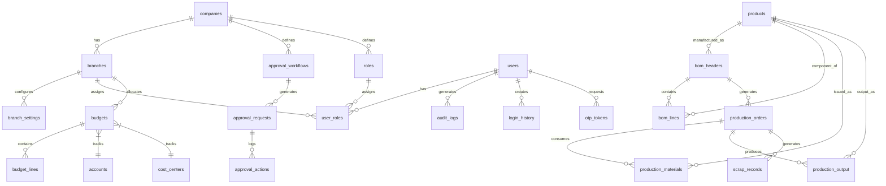

# Data Model: Phase 2 Modules

**Date**: 2026-04-02
**Purpose**: Define all database entities, relationships, and validation rules for Phase 2 modules

## Module 1: Multi-Branch

### branches
**Purpose**: Store branch/locations under a company

| Column | Type | Constraints | Description |
|--------|------|-------------|-------------|
| id | SERIAL | PRIMARY KEY | Unique identifier |
| company_id | INTEGER | NOT NULL, FK companies(id) | Parent company |
| name | VARCHAR(100) | NOT NULL | Branch name |
| code | VARCHAR(20) | UNIQUE, NOT NULL | Short code (e.g., "KHI-01") |
| address | TEXT | | Full address |
| phone | VARCHAR(20) | | Contact phone |
| email | VARCHAR(100) | | Contact email |
| is_default | BOOLEAN | DEFAULT FALSE | Default branch for company |
| is_active | BOOLEAN | DEFAULT TRUE | Active/inactive status |
| created_at | TIMESTAMPTZ | DEFAULT NOW() | Creation timestamp |
| updated_at | TIMESTAMPTZ | DEFAULT NOW() | Last update |

**Indexes**: `idx_branches_company`, `idx_branches_code`, `idx_branches_active`

**Validation Rules**:
- One default branch per company (partial unique index)
- Code must be unique across all companies
- Cannot deactivate branch if it has pending transactions

---

### branch_settings
**Purpose**: Branch-specific configuration (price lists, tax rates)

| Column | Type | Constraints | Description |
|--------|------|-------------|-------------|
| id | SERIAL | PRIMARY KEY | Unique identifier |
| branch_id | INTEGER | UNIQUE, FK branches(id) | Branch reference |
| price_list_id | INTEGER | FK price_lists(id) | Default price list |
| tax_rate | DECIMAL(5,2) | DEFAULT 0 | Default tax rate % |
| currency | VARCHAR(3) | DEFAULT 'PKR' | Branch currency |
| fiscal_year_start | DATE | DEFAULT '01-01' | Fiscal year start |

**Indexes**: `idx_branch_settings_branch`

---

## Module 2: Workflow & Approvals

### approval_workflows
**Purpose**: Define approval rules for different document types

| Column | Type | Constraints | Description |
|--------|------|-------------|-------------|
| id | SERIAL | PRIMARY KEY | Unique identifier |
| company_id | INTEGER | NOT NULL, FK companies(id) | Company |
| name | VARCHAR(100) | NOT NULL | Workflow name |
| module | VARCHAR(50) | NOT NULL | Module (purchase_orders, expenses, etc.) |
| condition_amount | DECIMAL(15,2) | | Threshold amount |
| condition_operator | VARCHAR(5) | DEFAULT '>' | >, >=, <, <= |
| levels_json | JSONB | NOT NULL | Approval levels definition |
| is_active | BOOLEAN | DEFAULT TRUE | Active status |
| created_at | TIMESTAMPTZ | DEFAULT NOW() | Creation timestamp |

**levels_json Structure**:
```json
[
  {
    "level": 1,
    "approver_role_id": 5,
    "approver_role": "Store Manager",
    "condition": "amount < 50000",
    "auto_approve_below": 10000
  },
  {
    "level": 2,
    "approver_role_id": 3,
    "approver_role": "Finance Manager",
    "condition": "amount >= 50000 AND amount < 200000"
  },
  {
    "level": 3,
    "approver_role_id": 2,
    "approver_role": "CFO",
    "condition": "amount >= 200000"
  }
]
```

**Indexes**: `idx_workflows_company`, `idx_workflows_module`, `idx_workflows_active`

---

### approval_requests
**Purpose**: Track documents pending approval

| Column | Type | Constraints | Description |
|--------|------|-------------|-------------|
| id | SERIAL | PRIMARY KEY | Unique identifier |
| company_id | INTEGER | NOT NULL, FK companies(id) | Company |
| workflow_id | INTEGER | FK approval_workflows(id) | Workflow |
| document_type | VARCHAR(50) | NOT NULL | Type (purchase_order, expense, etc.) |
| document_id | INTEGER | NOT NULL | Reference to document |
| status | VARCHAR(20) | DEFAULT 'pending' | pending, approved, rejected, cancelled |
| current_level | INTEGER | DEFAULT 1 | Current approval level |
| requested_by | INTEGER | FK users(id) | User who submitted |
| requested_at | TIMESTAMPTZ | DEFAULT NOW() | Submission time |
| completed_at | TIMESTAMPTZ | | Final approval/rejection time |
| completed_by | INTEGER | FK users(id) | Final approver |

**Indexes**: `idx_requests_company`, `idx_requests_status`, `idx_requests_document`, `idx_requests_workflow`

**State Transitions**:
```
pending → approved (all levels approved)
pending → rejected (any level rejects)
pending → cancelled (requester cancels)
```

---

### approval_actions
**Purpose**: Log individual approval/reject actions

| Column | Type | Constraints | Description |
|--------|------|-------------|-------------|
| id | SERIAL | PRIMARY KEY | Unique identifier |
| request_id | INTEGER | NOT NULL, FK approval_requests(id) | Approval request |
| level | INTEGER | NOT NULL | Approval level (1, 2, 3) |
| action | VARCHAR(20) | NOT NULL | approved, rejected, delegated |
| actioned_by | INTEGER | FK users(id) | Approver |
| comments | TEXT | | Approval comments |
| actioned_at | TIMESTAMPTZ | DEFAULT NOW() | Action timestamp |
| delegated_to | INTEGER | FK users(id) | If delegated, who to |

**Indexes**: `idx_actions_request`, `idx_actions_level`, `idx_actions_user`

---

## Module 3: Budget Management

### budgets
**Purpose**: Budget headers (annual budgets by company/branch)

| Column | Type | Constraints | Description |
|--------|------|-------------|-------------|
| id | SERIAL | PRIMARY KEY | Unique identifier |
| company_id | INTEGER | NOT NULL, FK companies(id) | Company |
| branch_id | INTEGER | FK branches(id) | Branch (NULL for company-wide) |
| fiscal_year | INTEGER | NOT NULL | Year (e.g., 2026) |
| name | VARCHAR(100) | NOT NULL | Budget name |
| status | VARCHAR(20) | DEFAULT 'draft' | draft, pending_approval, approved, rejected |
| total_amount | DECIMAL(15,2) | | Total budget amount |
| approved_by | INTEGER | FK users(id) | Approver |
| approved_at | TIMESTAMPTZ | | Approval timestamp |
| created_by | INTEGER | FK users(id) | Creator |
| created_at | TIMESTAMPTZ | DEFAULT NOW() | Creation timestamp |

**Indexes**: `idx_budgets_company`, `idx_budgets_fiscal_year`, `idx_budgets_branch`, `idx_budgets_status`

---

### budget_lines
**Purpose**: Individual budget line items (by account/department)

| Column | Type | Constraints | Description |
|--------|------|-------------|-------------|
| id | SERIAL | PRIMARY KEY | Unique identifier |
| budget_id | INTEGER | NOT NULL, FK budgets(id) | Budget |
| account_id | INTEGER | FK accounts(id) | Account (if by account) |
| cost_center_id | INTEGER | FK cost_centers(id) | Cost center (if by department) |
| jan through dec | DECIMAL(15,2) | DEFAULT 0 | Monthly amounts |
| total | DECIMAL(15,2) | NOT NULL | Sum of months |
| notes | TEXT | | Line item notes |

**Indexes**: `idx_budget_lines_budget`, `idx_budget_lines_account`, `idx_budget_lines_cost_center`

**Validation Rules**:
- Either account_id OR cost_center_id must be set (check constraint)
- Total must equal sum of monthly amounts
- Total cannot be negative

---

### mv_budget_vs_actual (Materialized View)
**Purpose**: Pre-computed budget vs actual comparison

| Column | Type | Description |
|--------|------|-------------|
| budget_id | INTEGER | Budget reference |
| account_id | INTEGER | Account |
| cost_center_id | INTEGER | Cost center |
| budget_amount | DECIMAL(15,2) | Budgeted amount |
| actual_amount | DECIMAL(15,2) | Actual spending |
| variance | DECIMAL(15,2) | budget - actual |
| variance_percent | DECIMAL(5,2) | Variance % |

**Refresh Strategy**: Trigger-based refresh on GL entry changes

---

## Module 4: User Roles & Security

### roles
**Purpose**: Define roles with permissions

| Column | Type | Constraints | Description |
|--------|------|-------------|-------------|
| id | SERIAL | PRIMARY KEY | Unique identifier |
| company_id | INTEGER | NOT NULL, FK companies(id) | Company (NULL for system roles) |
| name | VARCHAR(50) | NOT NULL | Role name |
| permissions_json | JSONB | NOT NULL | Permissions definition |
| is_system | BOOLEAN | DEFAULT FALSE | System role (cannot delete) |
| created_at | TIMESTAMPTZ | DEFAULT NOW() | Creation timestamp |

**permissions_json Structure**:
```json
{
  "modules": ["sales", "purchases", "inventory", "accounting", "reports", "crm"],
  "actions": {
    "sales": ["create", "read", "update", "delete", "approve", "export"],
    "purchases": ["create", "read", "update", "approve"],
    "inventory": ["create", "read", "update"],
    "accounting": ["read"],
    "reports": ["read", "export"],
    "crm": ["create", "read", "update"]
  }
}
```

**Predefined System Roles** (is_system = true):
1. **Super Admin**: All permissions, all companies
2. **Admin**: All permissions within company
3. **Accountant**: Full accounting, reports, limited sales/purchases
4. **Sales Manager**: Sales approvals, team reports
5. **Salesperson**: Create sales, view own data
6. **Store Manager**: Inventory, purchase requests
7. **HR Manager**: HR module, leave approvals
8. **Cashier**: Sales transactions, cash management
9. **Viewer**: Read-only access to all modules

**Indexes**: `idx_roles_company`, `idx_roles_system`

---

### user_roles
**Purpose**: Assign roles to users (with branch assignment)

| Column | Type | Constraints | Description |
|--------|------|-------------|-------------|
| id | SERIAL | PRIMARY KEY | Unique identifier |
| user_id | INTEGER | NOT NULL, FK users(id) | User |
| role_id | INTEGER | NOT NULL, FK roles(id) | Role |
| branch_id | INTEGER | FK branches(id) | Home branch |
| is_primary | BOOLEAN | DEFAULT FALSE | Primary role (if multiple) |
| assigned_at | TIMESTAMPTZ | DEFAULT NOW() | Assignment timestamp |
| assigned_by | INTEGER | FK users(id) | Who assigned |

**Indexes**: `idx_user_roles_user`, `idx_user_roles_role`, `idx_user_roles_branch`
**Unique Constraint**: `(user_id, role_id, branch_id)` - prevent duplicate assignments

---

### audit_logs
**Purpose**: Complete audit trail of all data changes

| Column | Type | Constraints | Description |
|--------|------|-------------|-------------|
| id | BIGSERIAL | PRIMARY KEY | Unique identifier |
| company_id | INTEGER | NOT NULL, FK companies(id) | Company |
| user_id | INTEGER | NOT NULL, FK users(id) | User |
| action | VARCHAR(20) | NOT NULL | INSERT, UPDATE, DELETE |
| table_name | VARCHAR(100) | NOT NULL | Table affected |
| record_id | INTEGER | NOT NULL | Record ID |
| old_values | JSONB | | Previous values (NULL for INSERT) |
| new_values | JSONB | | New values (NULL for DELETE) |
| ip_address | INET | | User IP address |
| user_agent | TEXT | | Browser/client info |
| created_at | TIMESTAMPTZ | DEFAULT NOW() | Timestamp |

**Partitioning**: By RANGE (created_at) monthly
**Indexes**: 
- `idx_audit_user_date` (user_id, created_at)
- `idx_audit_table_record` (table_name, record_id)
- `idx_audit_company_date` (company_id, created_at)

---

### login_history
**Purpose**: Track user login sessions

| Column | Type | Constraints | Description |
|--------|------|-------------|-------------|
| id | BIGSERIAL | PRIMARY KEY | Unique identifier |
| user_id | INTEGER | NOT NULL, FK users(id) | User |
| ip_address | INET | NOT NULL | Login IP |
| user_agent | TEXT | | Browser/client |
| status | VARCHAR(20) | DEFAULT 'success' | success, failed, blocked |
| failure_reason | VARCHAR(100) | | Reason if failed |
| login_at | TIMESTAMPTZ | DEFAULT NOW() | Login timestamp |
| logout_at | TIMESTAMPTZ | | Logout timestamp |
| session_id | UUID | UNIQUE | Session identifier |

**Indexes**: `idx_login_user`, `idx_login_status`, `idx_login_date`

---

### otp_tokens
**Purpose**: Store 2FA OTP tokens

| Column | Type | Constraints | Description |
|--------|------|-------------|-------------|
| id | SERIAL | PRIMARY KEY | Unique identifier |
| user_id | INTEGER | NOT NULL, FK users(id) | User |
| token_hash | VARCHAR(255) | NOT NULL | Hashed OTP |
| expires_at | TIMESTAMPTZ | NOT NULL | Expiry (5 min from creation) |
| is_used | BOOLEAN | DEFAULT FALSE | Used flag |
| created_at | TIMESTAMPTZ | DEFAULT NOW() | Creation timestamp |

**Indexes**: `idx_otp_user`, `idx_otp_expires`
**Validation**: Delete expired tokens (expires_at < NOW()) via scheduled job

---

## Module 5: Manufacturing / BOM

### bom_headers
**Purpose**: BOM master data (one per product version)

| Column | Type | Constraints | Description |
|--------|------|-------------|-------------|
| id | SERIAL | PRIMARY KEY | Unique identifier |
| company_id | INTEGER | NOT NULL, FK companies(id) | Company |
| product_id | INTEGER | NOT NULL, FK products(id) | Finished product |
| version | INTEGER | NOT NULL | Version number (1, 2, 3...) |
| status | VARCHAR(20) | DEFAULT 'draft' | draft, active, archived |
| effective_date | DATE | | When BOM becomes active |
| expiry_date | DATE | | When BOM expires (optional) |
| notes | TEXT | | BOM notes |
| created_by | INTEGER | FK users(id) | Creator |
| created_at | TIMESTAMPTZ | DEFAULT NOW() | Creation timestamp |

**Unique Constraint**: `(company_id, product_id, version)`
**Indexes**: `idx_bom_company`, `idx_bom_product`, `idx_bom_status`

---

### bom_lines
**Purpose**: BOM components (raw materials)

| Column | Type | Constraints | Description |
|--------|------|-------------|-------------|
| id | SERIAL | PRIMARY KEY | Unique identifier |
| bom_id | INTEGER | NOT NULL, FK bom_headers(id) | BOM |
| component_id | INTEGER | NOT NULL, FK products(id) | Component/raw material |
| quantity | DECIMAL(15,3) | NOT NULL | Quantity required |
| unit | VARCHAR(20) | NOT NULL | Unit of measure |
| waste_percent | DECIMAL(5,2) | DEFAULT 0 | Expected waste % |
| sequence | INTEGER | DEFAULT 0 | Operation sequence |

**Indexes**: `idx_bom_lines_bom`, `idx_bom_lines_component`

**Validation**:
- Quantity > 0
- waste_percent between 0 and 100
- Component cannot be same as BOM's finished product (prevent circular reference)

---

### production_orders
**Purpose**: Production job orders

| Column | Type | Constraints | Description |
|--------|------|-------------|-------------|
| id | SERIAL | PRIMARY KEY | Unique identifier |
| company_id | INTEGER | NOT NULL, FK companies(id) | Company |
| bom_id | INTEGER | NOT NULL, FK bom_headers(id) | BOM version |
| quantity | DECIMAL(15,3) | NOT NULL | Production quantity |
| status | VARCHAR(20) | DEFAULT 'planned' | planned, started, completed, cancelled |
| cost_center_id | INTEGER | FK cost_centers(id) | Production cost center |
| start_date | DATE | | Planned start |
| end_date | DATE | | Planned completion |
| actual_start_date | DATE | | Actual start |
| actual_end_date | DATE | | Actual completion |
| actual_hours | DECIMAL(10,2) | | Actual production hours |
| labor_rate | DECIMAL(10,2) | | Labor rate per hour |
| notes | TEXT | | Order notes |
| created_by | INTEGER | FK users(id) | Creator |
| created_at | TIMESTAMPTZ | DEFAULT NOW() | Creation timestamp |

**Indexes**: `idx_po_company`, `idx_po_bom`, `idx_po_status`, `idx_po_dates`

---

### production_materials
**Purpose**: Track materials issued to production

| Column | Type | Constraints | Description |
|--------|------|-------------|-------------|
| id | SERIAL | PRIMARY KEY | Unique identifier |
| production_order_id | INTEGER | NOT NULL, FK production_orders(id) | Production order |
| product_id | INTEGER | NOT NULL, FK products(id) | Material issued |
| required_qty | DECIMAL(15,3) | NOT NULL | Required quantity (from BOM) |
| issued_qty | DECIMAL(15,3) | DEFAULT 0 | Actually issued |
| issue_date | TIMESTAMPTZ | | When issued |
| issued_by | INTEGER | FK users(id) | Who issued |

**Indexes**: `idx_pm_po`, `idx_pm_product`
**Unique Constraint**: `(production_order_id, product_id)`

---

### production_output
**Purpose**: Record finished goods from production

| Column | Type | Constraints | Description |
|--------|------|-------------|-------------|
| id | SERIAL | PRIMARY KEY | Unique identifier |
| production_order_id | INTEGER | NOT NULL, FK production_orders(id) | Production order |
| product_id | INTEGER | NOT NULL, FK products(id) | Finished product |
| quantity | DECIMAL(15,3) | NOT NULL | Output quantity |
| cost | DECIMAL(15,2) | | Total production cost |
| unit_cost | DECIMAL(15,2) | | Cost per unit (calculated) |
| output_date | TIMESTAMPTZ | DEFAULT NOW() | Completion date |
| recorded_by | INTEGER | FK users(id) | Who recorded |

**Indexes**: `idx_po_output_po`, `idx_po_output_product`

---

### scrap_records
**Purpose**: Track production scrap/waste

| Column | Type | Constraints | Description |
|--------|------|-------------|-------------|
| id | SERIAL | PRIMARY KEY | Unique identifier |
| production_order_id | INTEGER | NOT NULL, FK production_orders(id) | Production order |
| product_id | INTEGER | NOT NULL, FK products(id) | Scraped material |
| quantity | DECIMAL(15,3) | NOT NULL | Scrap quantity |
| reason | VARCHAR(100) | | Scrap reason |
| recorded_at | TIMESTAMPTZ | DEFAULT NOW() | Timestamp |
| recorded_by | INTEGER | FK users(id) | Who recorded |

**Indexes**: `idx_scrap_po`, `idx_scrap_reason`

---

## Cross-Module Relationships



---

## Database Migration Order

**Phase 1 Foundation** (must be first):
1. `roles` table + seed predefined roles
2. `user_roles` table
3. `audit_logs` table + triggers
4. `login_history` table
5. `otp_tokens` table

**Phase 2 Core**:
6. `branches` table
7. `branch_settings` table
8. Add `branch_id` to all transactional tables (Phase 1)

**Phase 3 Workflows**:
9. `approval_workflows` table
10. `approval_requests` table
11. `approval_actions` table

**Phase 4 Budget**:
12. `budgets` table
13. `budget_lines` table
14. `mv_budget_vs_actual` materialized view

**Phase 5 Manufacturing**:
15. `bom_headers` table
16. `bom_lines` table
17. `production_orders` table
18. `production_materials` table
19. `production_output` table
20. `scrap_records` table

---

## Validation Rules Summary

| Entity | Rule | Enforcement |
|--------|------|-------------|
| branches | One default per company | Partial unique index |
| budget_lines | account_id XOR cost_center_id | CHECK constraint |
| budget_lines | total = sum(months) | Trigger validation |
| bom_lines | component ≠ finished product | CHECK constraint |
| approval_requests | status transitions valid | Trigger/state machine |
| otp_tokens | expires_at = created_at + 5 min | Default expression |
| audit_logs | Cannot be updated/deleted | REVOKE UPDATE, DELETE |

---

**Status**: ✅ Data model complete - Ready for API contract generation
